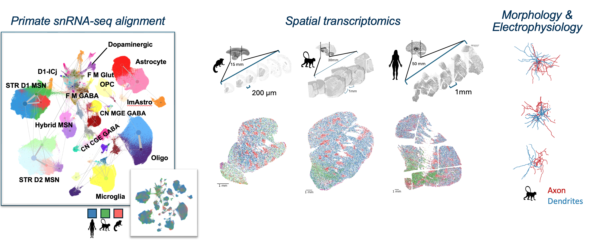
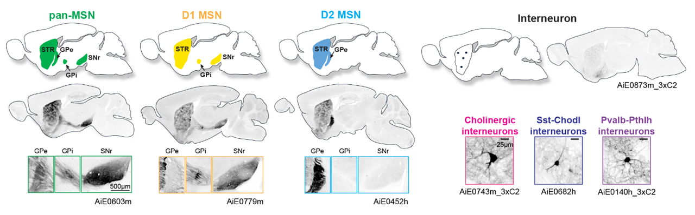

The basal ganglia (BG) are a system of interconnected brain structures that play a crucial role in motor control, learning, behavior, and emotion. With approximately 200 million neurons in the human basal ganglia alone, these structures are involved in a wide range of neurological processes and are implicated in numerous disorders affecting human health, including Parkinson’s disease, Huntington’s disease, and substance abuse disorders. To further understand the complexity of the basal ganglia, researchers have historically classified its neurons into various types based on their cytoarchitecture, connectivity, molecular profile, and functional properties. Recent advancements in high-throughput transcriptomic profiling and machine learning have revolutionized our ability to systematically categorize these cell types within species and integrate the taxonomies across species. We present a unified taxonomy of the mammalian basal ganglia, providing unprecedented insights into the conserved and divergent features of this system across humans, macaques, marmosets, and mice. 

In summary we are providing: 

* [A Cross-species taxonomy of basal ganglia](#rna-seq-data)
* [MapMyCells objects for mapping using `cell_type_mapper`](#cell-type-mapping-with-mapmycells)
* Comprehensive and consistent cell, cluster and sample metadata.
* Cell Annotation Platform (CAP) for continued annotation. _(pending)_
* ATAC-seq peaks, bigwigs and fragment files. _(pending)_

## **Consensus Cell Type Nomenclature**
* * *

To unify the field’s understanding of basal ganglia cell types across species, efforts supported by the NIH BRAIN Initiative have initiated a comprehensive nomenclature system that synthesizes pre-existing literature describing cell type nomenclature with new cross-species transcriptomic data. This effort includes coordinated contributions from the Human and Mammalian Brain Atlas (HMBA) project in the BRAIN Initiative Cell Atlas Network [(BICAN)](https://braininitiative.nih.gov/research/tools-and-technologies-brain-cells-and-circuits/brain-initiative-cell-atlas-network), and the Basal Ganglia AAV Toolbox project of the BRAIN Initiative [Armamentarium](https://braininitiative.nih.gov/research/tools-and-technologies-brain-cells-and-circuits/armamentarium-precision-brain-cell-access) for Precision Cell Access. This initiative integrates HMBA single-nucleus RNA sequencing (snRNA-seq) data from human, macaque, marmoset, and previously published mouse basal ganglia, with the goal of generating a consensus cell type taxonomy that can be widely adopted by the scientific community. By focusing on conserved marker genes and shared molecular profiles to supplement established names from the broader community, we have developed a standardized naming system that captures the evolutionary relationships and functional distinctions among basal ganglia cell types. The HMBA consensus basal ganglia taxonomy is designed to streamline communication, foster collaboration, and facilitate the development of novel research tools targeting specific cell types across multiple species. 

## **Sample and Cell Type Metadata Collection**
* * *

To support the HMBA consensus cell type taxonomy, we have compiled extensive metadata providing detailed information associated with each identified cell type. These metadata include information on gene expression patterns and marker genes from snRNA-seq as well as synonymous names from existing literature, including [Yao et al. 2023](https://www.nature.com/articles/s41586-023-06812-z) and [Siletti et al 2023](https://www.science.org/doi/10.1126/science.add7046). The metadata fields will be organized under an aligned taxonomy data format enabling integration with pre-existing tools such as CellxGene and Cell Annotation Platform.  

## **Cell Type Taxonomies** 
* * *

Our consensus basal ganglia cell type taxonomy is the result of [iterative clustering](https://github.com/AllenInstitute/transcriptomic_clustering) and cross-species integration of transcriptomic data from single-nucleus 10x Genomics multiomic profiling. The taxonomy encompasses neurons from key structures within the basal ganglia, including the caudate (Ca), putamen (Pu), nucleus accumbens (NAc), the external and internal segments of the globus pallidus (GPe, GPi), ventral pallidus (VeP), subthalamic nucleus (STN), and substantia nigra (SN). By combining data from multiple primate and rodent species, we have developed a consensus taxonomy that highlights both conserved and species-specific cell types. We validate our taxonomy through marker gene expression analysis, comparison with previously published taxonomies, and self-projection, ensuring the accuracy and robustness of each level in the taxonomic hierarchy. 

## **RNA-seq data**
* * *

Here we provide the pre-print ready version of the HMBA basal ganglia consensus taxonomy annotated onto human, macaque and marmoset 10X multiome (RNA-seq) profiling. Within each Allen Institute Taxonomy (AIT) .h5ad object you will find components necessary for analysis, visualization. Files required for cell type mapping are shared in the next section.

The AIT .h5ad files are organized according to a schema: 

| Species        | File Format  | Size          | Data Download     |
|:---------------|:-------------|:--------------|:------------------|
| Human          | AIT (.h5ad)  | 105G          | [AWS S3 URL](https://released-taxonomies-802451596237-us-west-2.s3.us-west-2.amazonaws.com/HMBA/BasalGanglia/BICAN_05072025_pre-print_release/Human_HMBA_basalganglia_AIT_pre-print.h5ad)
| Macaque        | AIT (.h5ad)  | 32GB          | [AWS S3 URL](https://released-taxonomies-802451596237-us-west-2.s3.us-west-2.amazonaws.com/HMBA/BasalGanglia/BICAN_05072025_pre-print_release/Macaque_HMBA_basalganglia_AIT_pre-print.h5ad)
| Marmoset       | AIT (.h5ad)  | 30GB          | [AWS S3 URL](https://released-taxonomies-802451596237-us-west-2.s3.us-west-2.amazonaws.com/HMBA/BasalGanglia/BICAN_05072025_pre-print_release/Marmoset_HMBA_basalganglia_AIT_pre-print.h5ad)
| Mouse          | AIT (.h5ad)  | TBD           | Available Q2 2025

Additional details about building and organizing Allen Institute Taxonomy (AIT) files can be found here: [AllenInstituteTaxonomy](https://github.com/AllenInstitute/AllenInstituteTaxonomy). 

## **Cell type mapping with MapMyCells**
* * *

Text and example notebook being prepared.

| Species        | precomputed_stats | query_markers |
|:---------------|:-------------|:--------------|
| Human          | [AWS S3 URL](https://released-taxonomies-802451596237-us-west-2.s3.us-west-2.amazonaws.com/HMBA/BasalGanglia/BICAN_05072025_pre-print_release/MapMyCells/Human.precomputed_stats.20250507.h5)  | [AWS S3 URL](https://released-taxonomies-802451596237-us-west-2.s3.us-west-2.amazonaws.com/HMBA/BasalGanglia/BICAN_05072025_pre-print_release/MapMyCells/Human.query_markers.20250507.json)
| Macaque        | [AWS S3 URL](https://released-taxonomies-802451596237-us-west-2.s3.us-west-2.amazonaws.com/HMBA/BasalGanglia/BICAN_05072025_pre-print_release/MapMyCells/Macaque.precomputed_stats.20250507.h5)  | [AWS S3 URL](https://released-taxonomies-802451596237-us-west-2.s3.us-west-2.amazonaws.com/HMBA/BasalGanglia/BICAN_05072025_pre-print_release/MapMyCells/Macaque.query_markers.20250507.json)
| Marmoset       | [AWS S3 URL](https://released-taxonomies-802451596237-us-west-2.s3.us-west-2.amazonaws.com/HMBA/BasalGanglia/BICAN_05072025_pre-print_release/MapMyCells/Marmoset.precomputed_stats.20250507.h5)  | [AWS S3 URL](https://released-taxonomies-802451596237-us-west-2.s3.us-west-2.amazonaws.com/HMBA/BasalGanglia/BICAN_05072025_pre-print_release/MapMyCells/Marmoset.query_markers.20250507.json)
| Mouse          | Available Q2 2025  | Available Q2 2025

## **A Cell Type-Specific Enhancer Virus Tool Collection** 
* * *

In collaboration with the BRAIN Armamentarium Consortium, we have developed an extensive collection of cell type-specific viral tools, designed to target and manipulate specific cell types identified in our cross-species integrated consensus BG taxonomy (Hunker, Wirthlin, et al. 2024). Using bulk or single nucleus ATAC-seq and multiomic data, we identify cell type-specific gene regulatory elements—particularly enhancers—linked to the cell types we identified through snRNA-seq. These efforts have culminated in a robust computational pipeline for identifying successful enhancers with a high degree of accuracy, the Cross-species Enhancer Ranking Pipeline (CERP). This pipeline allows us to identify and prioritize testing of the most promising candidate cell type enhancers for targeting homologous cell types across mammalian species. This viral tool collection comprises hundreds of enhancer adeno-associated virus (AAV) vectors, each with detailed brain expression analysis catalogues in the [Genetic Tools Atlas](https://portal.brain-map.org/genetic-tools/genetic-tools-atlas) (GTA). The most promising tools were also subjected to molecular validation. Additionally, we offer variants of these tools with enhancers optimized for stronger or more specific labeling, as well as variants delivering fluorescent proteins, channelrhodopsin variants, GCaMP variants, recombinases (Cre and Flp) to enable targeted experimental manipulation for functional studies. Many of these enhancer AAV vectors are already available through [Addgene](https://www.addgene.org/browse/article/28248509/), with new tools continuously being added to the collection. These collective resources provide researchers with a powerful toolkit for targeting and studying the diverse cell types of the basal ganglia across multiple species to advance our understanding of BG function and dysfunction in health and disease. 

## **Consensus cell types targeted for viral tool labeling**
* * *

Cell type subclasses in BG regions are conserved between mouse, human, and non-human primates. Candidate enhancers were identified for the major BG cell subclasses using a novel computational pipeline (CERP). Additional CERP enhancers were selected to target other BG cell populations, including groups of cell types with regional enrichment, such as dorsal vs. ventral striatum. 

## **Major cell types of basal ganglia targeted for viral tool labeling**
* * *

A major release of tools for labeling and manipulating MSNs (all, as well as D1 direct pathway and D2 indirect pathway subtypes) and interneurons (cholinergic, Sst-Chodl, and fast-spiking Pvalb-Pthlh subtypes) provides opportunities for experimental interrogation of striatal types with unprecedented specificity. Further details of tool design presented in Hunker, Wirthlin, et al. 2024, with most available now on [Addgene](https://www.addgene.org/browse/article/28248509/). Tools for a dozen additional cell types of the striatum and small nuclei of the basal ganglia planned for release in 2025. 

## **Related Resources** 
* * *

This resource will facilitate deeper exploration into the diversity of basal ganglia cell types, providing insights into the molecular underpinnings of neurological disorders and the evolutionary pathways that have shaped these critical brain structures. 

This page aims to serve as a gateway for researchers to access and explore our consensus basal ganglia cell type taxonomy. Through this resource, we hope to advance the understanding of basal ganglia function, facilitate the development of targeted therapies, and contribute to the broader field of comparative neurobiology. We encourage users to explore complementary efforts from both internal and outside collaborators.  

 [Genetic Tools Atlas](https://portal.brain-map.org/genetic-tools/genetic-tools-atlas)

 [BRAIN Armamentarium Collection](https://www.addgene.org/collections/brain-armamentarium/) of viral tools to target BG cell types 

[Cross-species Enhancer Ranking Pipeline (CERP)](https://github.com/AllenInstitute/CERP) - Identify candidate enhancers in regions of open chromatin using single nucleus ATAC-seq data sets. Prioritize candidate enhancers based on conserved cell type-specific chromatin accessibility between macaque and mouse using ranking modules such as [PeakRankR](https://github.com/AllenInstitute/PeakRankR). 

Supported by the NIH BRAIN Initiative Armamentarium grant UF1MH128339 and Cell Atlas Network grant UM1MH130981. 

 

 

