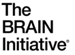
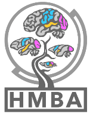

# Consensus Basal Ganglia Cell Type Atlas: Annotation Coordination Hub

This repository is a central resource for annotators collaborating on a cross-species consensus atlas of basal ganglia cell types. Our collaborative goal is to integrate molecular, anatomical, and developmental insights to refine basal ganglia cell type taxonomies in human, macaque, marmoset and mouse. 

### Goals of the Annotation Effort:
- **Establish** a consensus cell type nomenclature across species.
- **Identify** robust marker genes (including transcription factors and neurotransmitters) and assess conservation across species.
- **Clarify** neuronal diversity through anatomical and developmental characterization.
- **Reorganize** and refine clusters into biologically meaningful hierarchical groups.

### How to Participate:
- [**Create a profile**](https://celltype.info/docs/creating-a-profile) for the Cell Annotation Platform (CAP).
- [**Load the CAP atlas**](https://celltype.info/project/637) and click on "Molecular Data".
- [**Provide feedback**](https://celltype.info/docs/providing-feedback-on-annotations) on annotations in the [**Molecular Data Overview**](https://celltype.info/docs/molecular-data-page-overview).

### Additional Resources:
- **[CAP Orientation Videos](https://www.youtube.com/playlist?list=PLKRocgU6P8sIXJKtoyhBtOm38sMH1Z7gq)** led by Evan Biederstedt.
- **[Cell type metadata](https://docs.google.com/spreadsheets/d/1Pj1tI77L_GdCqj-liaCUFvvwlEDBkyj-QMRhVe9jFf0/edit?usp=sharing)** including marker genes and anatomical distributions.

## Cell Annotation Platform (CAP)

To facilitate collaborative annotation with members of the community we are using the Cell Annotation Platform ([CAP](https://celltype.info/)) to put our work into the hands of researchers who can provide feedback, thoughts and expert information about the consensus nomeclature system being proposed. 

We have provided the Consensus Cross-species Taxonomy as an integrated object containing nuclei/cells from Human, Macaque and Marmoset as a complete Atlas and various sub-groupings of taxonomic terms to provide a higher-resolution view for each Class of cell types.

* [HMBA Consensus Basal Ganglia Atlas](https://celltype.info/project/637/dataset/1542)
   * [HMBA Consensus Basal Ganglia Atlas: CN LGE GABA](https://celltype.info/project/637/dataset/1541)
   * [HMBA Consensus Basal Ganglia Atlas: Interneurons](https://celltype.info/project/637/dataset/1539)
   * [HMBA Consensus Basal Ganglia Atlas: Dopaminergic](https://celltype.info/project/637/dataset/1538)
   * [HMBA Consensus Basal Ganglia Atlas: Non-neurons](https://celltype.info/project/637/dataset/1540)

If you have any questions or requests please reach out to either Nelson Johansen (nelson.johansen@alleninstitute.org) or Trygve Bakken (trygveb@alleninstitute.org).

## Conserved Marker Analysis

Computational identificaiton of conserved marker genes across species will be provided shortly.

---

## Spatail transcriptomci cirrocumulus

We have provided a cirrocumulus browser for access to the Macaque spatial transcriptomics data available at: https://cirro-aibs.org/.

* Login with user: hmbajamboree@gmail.com; password: welcomeannotators
* Click Open (near top right) and chose the Macauqe BG Neurons for Jamboree

Performance is slow, please have patience.

### Coordination Team:
Trygve Bakken, Nelson Johansen, Yuanyuan Fu, Tyler Mollenkopf, Jeremy Miller, Lauren Alfiler, Yasmeen Hussain and Julei Nyhus (Allen Institute for Brain Science)

Supported by the NIH Cell Atlas Network grant UM1MH130981 and by the NINDS grant U24NS133077. 

 

 

